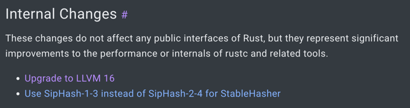
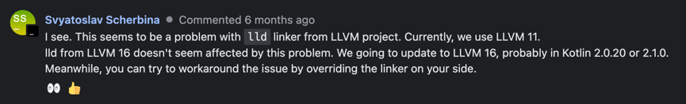

# 问题描述

## rust 方面

rust 自1.70.0(含)之后将llvm升级至16

来源: <https://releases.rs/docs/1.70.0/#internal-changes>



这会导致kmp在ming-w64平台链接rust static库时产生-exclude-symbol错误

错误信息:

```shell
e: /Users/bppleman/.konan/dependencies/apple-llvm-20200714-macos-x64-essentials/bin/clang++ invocation reported errors

The /Users/bppleman/.konan/dependencies/apple-llvm-20200714-macos-x64-essentials/bin/clang++ command returned non-zero exit code: 1.
output:
clang version 11.1.0 (https://github.com/apple/llvm-project 9205ffc7869a87cf3906b80dbd45b969c5794ef7)
Target: x86_64-pc-windows-gnu
Thread model: posix
InstalledDir: /Users/bppleman/.konan/dependencies/apple-llvm-20200714-macos-x64-essentials/bin
"/Users/bppleman/.konan/dependencies/apple-llvm-20200714-macos-x64-essentials/bin/ld.lld" --sysroot=/Users/bppleman/.konan/dependencies/msys2-mingw-w64-x86_64-2 -m i386pep -Bstatic -o /Users/bppleman/kgit2/kio/library/build/bin/mingwX64/debugTest/test.exe /Users/bppleman/.konan/dependencies/msys2-mingw-w64-x86_64-2/x86_64-w64-mingw32/lib/crt2.o /Users/bppleman/.konan/dependencies/msys2-mingw-w64-x86_64-2/lib/gcc/x86_64-w64-mingw32/9.2.0/crtbegin.o -L/Users/bppleman/.konan/dependencies/msys2-mingw-w64-x86_64-2/lib/gcc/x86_64-w64-mingw32/9.2.0 -L/Users/bppleman/.konan/dependencies/msys2-mingw-w64-x86_64-2/x86_64-w64-mingw32/lib -L/Users/bppleman/.konan/dependencies/msys2-mingw-w64-x86_64-2/lib -L/Users/bppleman/.konan/dependencies/msys2-mingw-w64-x86_64-2/x86_64-w64-mingw32/sys-root/mingw/lib /private/var/folders/k4/877lnnqs0wg9lsvfkxyz8j500000gn/T/konan_temp17578694536950889703/test.exe.o /var/folders/k4/877lnnqs0wg9lsvfkxyz8j500000gn/T/included18034943738294566109/librio.a -lws2_32 -lbcrypt -luserenv -lntdll -lstdc++ --dynamicbase -Bstatic --whole-archive -lwinpthread --no-whole-archive -Bdynamic -lstdc++ --start-group -lmingw32 -lgcc -lgcc_eh -lmoldname -lmingwex -lmsvcrt -ladvapi32 -lshell32 -luser32 -lkernel32 --end-group /Users/bppleman/.konan/dependencies/msys2-mingw-w64-x86_64-2/lib/gcc/x86_64-w64-mingw32/9.2.0/crtend.o
lld-link: warning: ignoring unknown argument: -exclude-symbols:_ZN70_$LT$alloc..vec..Vec$LT$T$C$A$GT$$u20$as$u20$core..ops..drop..Drop$GT$4drop17hc8146da2ec4cb231E
lld-link: error: -exclude-symbols:_ZN70_$LT$alloc..vec..Vec$LT$T$C$A$GT$$u20$as$u20$core..ops..drop..Drop$GT$4drop17hc8146da2ec4cb231E is not allowed in .drectve
lld-link: warning: ignoring unknown argument: -exclude-symbols:___chkstk_ms
lld-link: error: -exclude-symbols:___chkstk_ms is not allowed in .drectve
lld-link: warning: ignoring unknown argument: -exclude-symbols:_ZN3std2io8buffered9bufwriter18BufWriter$LT$W$GT$10write_cold17h9478e9580268e40bE
lld-link: warning: ignoring unknown argument: -exclude-symbols:_ZN3std2io8buffered9bufwriter18BufWriter$LT$W$GT$12write_to_buf17hf228ea982de4df5bE
lld-link: warning: ignoring unknown argument: -exclude-symbols:_ZN3std2io8buffered9bufwriter18BufWriter$LT$W$GT$13with_capacity17h8c915c151c351708E
lld-link: warning: ignoring unknown argument: -exclude-symbols:_ZN3std2io8buffered9bufwriter18BufWriter$LT$W$GT$9flush_buf17ha5e1ec561df9e68fE
lld-link: warning: ignoring unknown argument: -exclude-symbols:_ZN4core3ptr42drop_in_place$LT$std..io..error..Error$GT$17h6e25eaf4fc4ed7a6E.llvm.5624595838175464558
lld-link: warning: ignoring unknown argument: -exclude-symbols:_ZN4core3ptr78drop_in_place$LT$alloc..boxed..Box$LT$rio..io..typed_write..TypedWrite$GT$$GT$17h223b8c18fff2dfe4E.llvm.5624595838175464558
lld-link: warning: ignoring unknown argument: -exclude-symbols:_ZN5alloc7raw_vec11finish_grow17h043de3e0642f9237E.llvm.5624595838175464558
lld-link: warning: ignoring unknown argument: -exclude-symbols:_ZN5alloc7raw_vec19RawVec$LT$T$C$A$GT$7reserve21do_reserve_and_handle17h55204ce01a0cfb58E
lld-link: warning: ignoring unknown argument: -exclude-symbols:_ZN77_$LT$alloc..raw_vec..RawVec$LT$T$C$A$GT$$u20$as$u20$core..ops..drop..Drop$GT$4drop17h10edb9527cc3d962E
lld-link: warning: ignoring unknown argument: -exclude-symbols:_ZN83_$LT$std..io..buffered..bufwriter..BufWriter$LT$W$GT$$u20$as$u20$std..io..Write$GT$5flush17h7d02ca886007aa77E
lld-link: warning: ignoring unknown argument: -exclude-symbols:_ZN90_$LT$std..io..buffered..bufwriter..BufWriter$LT$W$GT$$u20$as$u20$core..ops..drop..Drop$GT$4drop17h6846c0e8624299d2E
lld-link: error: -exclude-symbols:_ZN3std2io8buffered9bufwriter18BufWriter$LT$W$GT$10write_cold17h9478e9580268e40bE is not allowed in .drectve
lld-link: error: -exclude-symbols:_ZN3std2io8buffered9bufwriter18BufWriter$LT$W$GT$12write_to_buf17hf228ea982de4df5bE is not allowed in .drectve
lld-link: error: -exclude-symbols:_ZN3std2io8buffered9bufwriter18BufWriter$LT$W$GT$13with_capacity17h8c915c151c351708E is not allowed in .drectve
lld-link: error: -exclude-symbols:_ZN3std2io8buffered9bufwriter18BufWriter$LT$W$GT$9flush_buf17ha5e1ec561df9e68fE is not allowed in .drectve
lld-link: error: -exclude-symbols:_ZN4core3ptr42drop_in_place$LT$std..io..error..Error$GT$17h6e25eaf4fc4ed7a6E.llvm.5624595838175464558 is not allowed in .drectve
lld-link: error: -exclude-symbols:_ZN4core3ptr78drop_in_place$LT$alloc..boxed..Box$LT$rio..io..typed_write..TypedWrite$GT$$GT$17h223b8c18fff2dfe4E.llvm.5624595838175464558 is not allowed in .drectve
lld-link: error: -exclude-symbols:_ZN5alloc7raw_vec11finish_grow17h043de3e0642f9237E.llvm.5624595838175464558 is not allowed in .drectve
lld-link: error: -exclude-symbols:_ZN5alloc7raw_vec19RawVec$LT$T$C$A$GT$7reserve21do_reserve_and_handle17h55204ce01a0cfb58E is not allowed in .drectve
lld-link: error: -exclude-symbols:_ZN77_$LT$alloc..raw_vec..RawVec$LT$T$C$A$GT$$u20$as$u20$core..ops..drop..Drop$GT$4drop17h10edb9527cc3d962E is not allowed in .drectve
lld-link: error: -exclude-symbols:_ZN83_$LT$std..io..buffered..bufwriter..BufWriter$LT$W$GT$$u20$as$u20$std..io..Write$GT$5flush17h7d02ca886007aa77E is not allowed in .drectve
lld-link: error: -exclude-symbols:_ZN90_$LT$std..io..buffered..bufwriter..BufWriter$LT$W$GT$$u20$as$u20$core..ops..drop..Drop$GT$4drop17h6846c0e8624299d2E is not allowed in .drectve
lld-link: warning: ignoring unknown argument: -exclude-symbols:__udivti3
lld-link: error: -exclude-symbols:__udivti3 is not allowed in .drectve
clang-11: error: linker command failed with exit code 1 (use -v to see invocation)
```

---

# kotlin 方面

kmp默认下载的llvm版本为11: `apple-llvm-20200714-macos-x64-essentials`

该文章描述了kotlin-native在mingw-w64平台链接时的一些问题

<https://youtrack.jetbrains.com/issue/KT-65671/Kotlin-Native-Failed-linking-cinterop-static-library-for-mingwX64-target>



其中关键在于官方人员提到这是lld的一个问题，原来一直使用llvm-11，升级到llvm-16则可以工作


---

# 解决方案:

### 1. 使用1.69.0版本的rust

这可以使用kotlin-multiplatform的默认设置进行开发，但是这样会导致rust版本过低，无法使用一些新特性

### 2. 更新llvm版本

这将更加一劳永逸，但是需要自行下载llvm-16或以上版本。

以下步骤适用于macOS平台:

```shell
brew install llvm@16
ln -s /usr/local/Cellar/llvm@16/16.0.6_1/bin/ld.lld $HOME/.konan/dependencies/apple-llvm-20200714-macos-x64-essentials/bin/ld.lld
```
对于其它平台，后续添加
